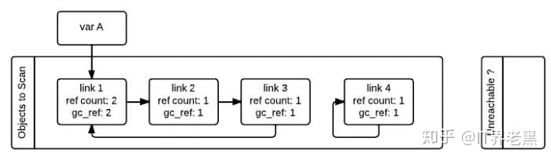
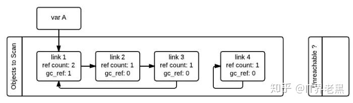
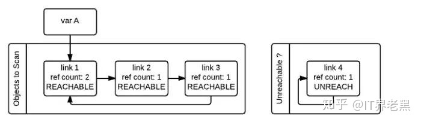

# Python Q & A

> 主要参考：
>
> - [python_interview_question(4.7k stars)](https://github.com/kenwoodjw/python_interview_question#%E6%96%87%E4%BB%B6%E6%93%8D%E4%BD%9C)
>
> - [interview_python (15.1k stars)](https://github.com/taizilongxu/interview_python)
>
> - [python-interview (31 stars)](https://github.com/wangyitao/python-interview)
>
> - [python -81](https://developer.aliyun.com/article/656961)
> - [stackoverflow about python](https://taizilongxu.gitbooks.io/stackoverflow-about-python/content/)
> - [廖雪峰Python](https://www.liaoxuefeng.com/wiki/1016959663602400/1017328655674400)

[TOC]

## 理论类

### Q1：函数可变参数`*args` 和 `**kwargs`

> 参考网站：http://showteeth.tech/posts/38814.html

这两个参数都是表示给函数传不定数量的参数（不确定最后使用这个函数的时候会传递多少参数，也叫可变参数），两者的差异主要是在：

- `*args`：接受不定量的非关键字参数，如`test('Hello','Welcome')`
- `**kwargs`：接受不定量个关键字参数，如`test(x=1,y=2)`

`*args`和`kwargs`参数关键的是最前面的`*`和`**`，至于后面的字母`args`和`kwargs`只是约定俗称的叫法。

此外，可变参数在函数调用时一定在普通参数之后，如果调换顺序会报错。

### Q2：`super().__init__()`

`super().__init__()`，就是继承父类的`init`方法。

python`class`继承时，只能继承父类中的函数，而不能继承父类中的属性。

```markdown
class Root(object):
  def __init__(self):
      self.x= '这是属性'

  def fun(self):
  	#print(self.x)
      print('这是方法')
      
class A(Root):
  def __init__(self):
      print('实例化时执行')

test = A()		#实例化类
test.fun()	#调用方法
test.x		#调用属性
```

输出：

```markdown
Traceback (most recent call last):

实例化时执行

这是方法

  File "/hom/PycharmProjects/untitled/super.py", line 17, in <module>

    test.x  # 调用属性

AttributeError: 'A' object has no attribute 'x'
```

可以看到，此时父类的方法继承成功，但是父类的属性并未继承。

```python
class Root(object):
 	def __init__(self):
		self.x = '这是属性'

	def fun(self):
		print(self.x)
		print('这是方法')


class A(Root):
	def __init__(self):
		super(A,self).__init__()
		print('实例化时执行')


test = A()  # 实例化类
test.fun()  # 调用方法
test.x  # 调用属性
```

输出：

```markdown
实例化时执行

这是属性

这是方法
```

所以`super().__init__()`的作用也就显而易见了，就是执行父类的构造函数，使得我们能够调用父类的属性。

==注==：`super()`在python2/3中的区别：

- Python3可以直接写成`super().方法名(参数)`
- Python2必须写成`super(父类,self).方法名(参数)`

### Q3：私有属性 & 私有方法

双下划线开头，声明该属性或该方法为私有，不能在类的外部被使用或直接访问；

一种情况除外，可以使用`object._class__attrname(对象名.\_类名\_\_私有属性名)访问属性。

```text
class JustCounter:
    __secretCount = 0  # 私有变量
    publicCount = 0    # 公开变量
 
	def count(self):
        self.__secretCount += 1
        self.publicCount += 1
        print self.__secretCount
 
counter = JustCounter()
counter.count()
counter.count()
print counter.publicCount
print counter.__secretCount  # 报错，实例不能访问私有变量
```

```text
class Runoob:
    __site = "www.runoob.com"

runoob = Runoob()
print runoob._Runoob__site
```

### Q4：单下划线、双下划线、头尾下划线

- \_\_foo\_\_: 定义的是特殊方法，一般是系统定义名字 ，类似 \_\_init\_\_() 之类的。
- **_foo**: 以单下划线开头的表示的是 protected 类型的变量，即保护类型只能允许其本身与子类进行访问，不能用于 **from module import \***
- **__foo**: 双下划线的表示的是私有类型(private)的变量, 只能是允许这个类本身进行访问了。

### Q5：`\#!/usr/bin/env python` & `# -*- coding:utf-8 -*-`

- `\#!/usr/bin/env python`：指定[/usr/bin/env]目录下的python解释器执行python脚本

- `# -*- coding:utf-8 -\*-`：

  Python中默认的编码格式是 ASCII 格式，在没修改编码格式时无法正确打印汉字，在读取中文时会报错。Python3.X 源码文件默认使用utf-8编码，可以正常解析中文，一般而言，都会声明为utf-8编码。

### Q6：参数传递

```python
# Case 1
a = 1
def fun(a):
    print "func_in",id(a)   # func_in 41322472
    a = 2
    print "re-point",id(a), id(2)   # re-point 41322448 41322448
print "func_out",id(a), id(1)  # func_out 41322472 41322472
fun(a)
print a  # 1
```

```python
# Case 2
a = []
def fun(a):
    print "func_in",id(a)  # func_in 53629256
    a.append(1)
print "func_out",id(a)     # func_out 53629256
fun(a)
print a  # [1]
```

对象有两类：

- 可更改对象（mutable）：`list`、`dict`、`set`。总是会按引用传入函数，函数代码组中对变量数据结构的任何改变都会反映到调用代码中。
- 不可更改对象（immutable）：`string`、`tuples`、`numbers`。总是会按值传入函数，函数中对变量的任何修改是这个函数私有的，不会反映到调用代码中。

### Q7：元类（metaclass）

> https://taizilongxu.gitbooks.io/stackoverflow-about-python/content/part/2.html

### Q8：`@staticmethod` & `@classmethod`

> [参考](https://blog.csdn.net/GeekLeee/article/details/52624742?spm=1001.2101.3001.6661.1&utm_medium=distribute.pc_relevant_t0.none-task-blog-2%7Edefault%7ECTRLIST%7ERate-1-52624742-blog-9615239.pc_relevant_multi_platform_whitelistv3&depth_1-utm_source=distribute.pc_relevant_t0.none-task-blog-2%7Edefault%7ECTRLIST%7ERate-1-52624742-blog-9615239.pc_relevant_multi_platform_whitelistv3&utm_relevant_index=1)

Python中，要使用某个类的方法或属性，首先需要实例化一个类再调用方法或属性。而使用`@staticmethod`或`@classmethod`，就可以不用实例化，直接`类名.方法名()`来调用。这样有利于组织代码，把某些应该属于某个类的函数给放到那个类去，同时有利于命名空间的整洁。

**两者区别**

- `@staticmethod`不需要表示自身对象的`self`或自身类的`cls`参数，就和使用普通函数一样，无法访问类的对象和属性，通常包含与类有关的逻辑代码。
- `@classmethod`也不需要`self`参数，但是第一个参数需要是表示自身类的`cls`参数。可以访问类的对象和属性，可以修改类属性，也可以实例化对象。

```python
def foo(x):
    print "executing foo(%s)"%(x)

class A(object):
    def foo(self,x):
        print "executing foo(%s,%s)"%(self,x)

    @classmethod
    def class_foo(cls,x):
        print "executing class_foo(%s,%s)"%(cls,x)

    @staticmethod
    def static_foo(x):
        print "executing static_foo(%s)"%x

a=A()
```

|       | 实例方法 | 类方法         | 静态方法        |
| ----- | -------- | -------------- | --------------- |
| a=A() | a.foo(x) | a.class_foo(x) | a.static_foo(x) |
| A     | 不可用   | A.class_foo(x) | A.static_foo(x) |

**应用场景**

- `@classmethod`

  ```python
  # 不使用@classmethod 调用类属性时只能先实例化一个对象。
  # 类代码的关系扩散到了类定义的外面，造成了代码维护的困难。
  def A(cls_obj):
      return cls_obj.param
  class Myclass(object):
      param = 0
      def __init__(self):
          Myclass.param = Myclass.param + 1
  b = Myclass()
  print(A(b))
  ```

  ```python
  # 使用@classmethod 与上述代码等效。
  class Myclass(object):
      param = 0
      def __init__(self):
          Myclass.param = Myclass.param + 1
      @classmethod
      def A(cls):
          return cls.param
  print(Myclass.A())
  ```

- `@staticmethod`

  ```python
  # 不使用@staticmethod
  # 经常有一些和类有关的功能但是运行时又不需要实例和类参与的情况下需要用到静态方法。比如更改环境变量或者修改其他类的属性。
  Ind = 'ON'
  def check():
      return Ind=='ON'
  class Myclass(object):
      def __init__(self,param):
          self.param = param
      def pparam(self):
          if check():
              print("param of Myclass", self.param)
  ```

  ```python
  # 使用@staticmethod
  IND = "ON"
  class Myclass(object):
      def __init__(self, param):
          self.param = param
      @staticmethod
      def check():
          return IND=="ON"
      def pparam(self):
          if check():
              print("param of Myclass", self.param)
  
  ```

### Q9：类变量和实例变量

```python
class Test(object):  
    num_of_instance = 0  
    def __init__(self, name):  
        self.name = name  
        Test.num_of_instance += 1  

if __name__ == '__main__':  
    print Test.num_of_instance   # 0
    t1 = Test('jack')  
    print Test.num_of_instance   # 1
    t2 = Test('lucy')  
    print t1.name , t1.num_of_instance  # jack 2
    print t2.name , t2.num_of_instance  # lucy 2
```

- 类变量：可在类的所有实例之间共享的值（也就是说，它们不是单独分配给每个实例的）。例如上例中，`num_of_instance` 就是类变量，用于跟踪存在着多少个Test 的实例。

- 实例变量：实例化之后，每个实例单独拥有的变量。

```python
# 例子2
class Person:
    name="aaa"

p1=Person()
p2=Person()
p1.name="bbb"
print p1.name  # bbb
print p2.name  # aaa
print Person.name  # aaa
```

`p1.name="bbb"`实例调用了类变量，一开始是指向类变量的，但是在实例`p1`的作用域里把类变量的引用改变了，此时`name`变成了一个实例变量，`self.name`不再引用`Person`类的类变量`name`了。而`p2`引用的是类变量。

```python
# 例子3
class Person:
    name=[]

p1=Person()
p2=Person()
p1.name.append(1)
print p1.name  # [1]
print p2.name  # [1]
print Person.name  # [1]
```

**和可更改对象、不可更改对象类似！！**

### Q10：Python自省

自省就是面向对象的语言所写的程序在运行时,所能知道对象的类型.简单一句就是运行时能够获得对象的类型.比如`type()`,`dir()`,`getattr()`,`hasattr()`,`isinstance()`.

- `type()`：返回类型
- `dir()`：返回参数的属性、方法列表
- `getattr()`：返回对象属性值
- `hasattr()`：判断对象是否包含对应的属性
- `isinstance()`：判断一个对象是否是指定的类型

### Q11：格式化字符串

### Q12：生成器 & 迭代器

> [StackOverflow](https://taizilongxu.gitbooks.io/stackoverflow-about-python/content/part/1.html)
>
> [菜鸟教程](https://www.runoob.com/python3/python3-iterator-generator.html)

### Q13：装饰器

[StackOverflow](https://stackoverflow.com/questions/739654/how-to-make-function-decorators-and-chain-them-together)

### Q14：切片编程 AOP

### Q15：鸭子类型 Duck Typing

> Google的定义
>
> With nominative typing, an object is *of a given type* if it is declared to be.
>
> In duck typing, an object is *of a given type* if it has all methods and properties required by that type.Duck typing can be viewed as a usage-based structural equivalence between a given object and the requirements of a type.

其实动态语言是相对静态语言而言的，**静态语言**的特点是在程序执行前，代码编译时从代码中就可以知道一切，比如变量的类型，方法的返回值类型。

而**动态语言**只有等到程序运行时才知道一切，变量（严格来说叫名字，就像人的名字一样）不需要指定类型，变量本身没有任何类型信息，类型信息在对象身上，对象是什么类型，必须等到程序运行时才知道，动态类型语言的优点在于方便阅读，不需要写很多类型相关的代码；缺点是不方便调试，命名不规范时会造成读不懂，不利于理解等。

动态语言中经常提到鸭子类型，所谓鸭子类型就是：如果走起路来像鸭子，叫起来也像鸭子，那么它就是鸭子（If it walks like a duck and quacks like a duck, it must be a duck）。鸭子类型是编程语言中动态类型语言中的一种设计风格，一个对象的特征不是由父类决定，而是通过对象的方法决定的。

动态语言，如：PHP、Python、JavaScript
静态语言，如：C++、Java、Golang

### Q16：为什么Python不需要函数重载？

函数重载主要是为了解决两个问题。

1。可变参数类型。

2。可变参数个数。

另外，一个基本的设计原则是，仅仅当两个函数除了参数类型和参数个数不同以外，其功能是完全相同的，此时才使用函数重载，如果两个函数的功能其实不同，那么不应当使用重载，而应当使用一个名字不同的函数。

好吧，那么对于情况 1 ，函数功能相同，但是参数类型不同，python 如何处理？答案是根本不需要处理，因为 python 可以接受任何类型的参数，如果函数的功能相同，那么不同的参数类型在 python 中很可能是相同的代码，没有必要做成两个不同函数。

那么对于情况 2 ，函数功能相同，但参数个数不同，python 如何处理？大家知道，答案就是缺省参数。对那些缺少的参数设定为缺省参数即可解决问题。因为你假设函数功能相同，那么那些缺少的参数终归是需要用的。

好了，鉴于情况 1 跟 情况 2 都有了解决方案，python 自然就不需要函数重载了。

### Q17：新式类 & 旧式类

### Q18：Python 推导式

### Q19：类中的函数：`__new__`和`__init__`

> 参考：https://stackoverflow.com/questions/674304/why-is-init-always-called-after-new

两者都是有关类的函数。

- **作用**：当我们实例化一个类时，`__new__`控制我们如何创建一个实例，`__init__`控制我们如何初始化一个实例。

- **先后**：首先得创建一个实例，然后才能对其初始化。（`__init__`函数有`self`参数）
- **返回值**：`__new__`返回一个实例，`__init__`不返回任何值。

### Q20：各类设计模式

- 单例模式...手写单例模式 4种方法

### Q21：`nonlocal` & `Global`

```python
# 没有用nonlocal 和 global
x = 0
def outer():
    x = 1
    def inner():
        x = 2
        print("inner:", x)

    inner()
    print("outer:", x)

outer()
print("global:", x)

# inner: 2
# outer: 1
# global: 0
```

```python
# nonlocal
x = 0
def outer():
    x = 1
    def inner():
        nonlocal x
        x = 2
        print("inner:", x)

    inner()
    print("outer:", x)

outer()
print("global:", x)

# inner: 2
# outer: 2
# global: 0
```

```python
# global
x = 0
def outer():
    x = 1
    def inner():
        global x
        x = 2
        print("inner:", x)

    inner()
    print("outer:", x)

outer()
print("global:", x)

# inner: 2
# outer: 1
# global: 2
```

### Q22：Python作用域

1. Local局部作用域：能够访问局部变量的作用域，比如一个函数/方法 内部

2. Enclosing嵌套作用域：包含非局部（nonlocal）、非全局（nonglobal）变量。比如函数A中嵌套了函数B，则A中的变量就是nonlocal，B中的变量是local

   ```python
   g_count = 0  # 全局作用域
   def outer():
       o_count = 1  # 闭包函数外的函数中
       def inner():
           i_count = 2  # 局部作用域
           # 这里可以访问o_count，但不能修改
   ```

3. Global全局作用域：能够访问全局变量的作用域

4. Built-in内置作用域：能够访问内置函数和内置变量的作用域。如`max`函数、`abs`函数


### Q23：高阶函数

在Python中，函数是一个对象，类也是一个对象，一切皆为对象。

作为一个对象，所以：

- 可以把它赋值给一个变量
- 可以对此赋值
- 可以给它添加属性
- 可以作为函数参数来传递它

而高阶函数：把一个函数作为参数来传递的函数，称之为高阶函数。

==函数式编程的特点之一==：允许把函数本身作为参数传入另一个函数，还允许返回一个函数。（装饰器把函数作为返回值，也是函数式编程的一种）

```python
def add(x, y, f):
    return f(x) + f(y)
```

#### `map()`

`map()`函数接收两个参数，一个是函数，一个是`Iterable`，`map`将传入的函数依次作用到序列的每个元素，并把结果作为新的`Iterator`返回。

```python
>>> def f(x):
...     return x * x
...
>>> r = map(f, [1, 2, 3, 4, 5, 6, 7, 8, 9])
# 这里的f当然也可以用lamda匿名函数来实现
>>> list(r)
[1, 4, 9, 16, 25, 36, 49, 64, 81]
```

`map()`把运算规则`f`抽象了，使得我们显而易见得知道代码在干什么。

#### `reduce()`

`reduce`把一个函数作用在一个序列`[x1, x2, x3, ...]`上，这个函数必须接收两个参数，`reduce`把结果继续和序列的下一个元素做累积计算，其效果就是：

```python
reduce(f, [x1, x2, x3, x4]) = f(f(f(x1, x2), x3), x4)
```

```python
# reduce() 应用例子
# 把序列[1,3,5,7,9]变成整数13579
>>> from functools import reduce
>>> def fn(x, y):
...     return x * 10 + y
...
>>> reduce(fn, [1, 3, 5, 7, 9])
13579
```

#### `filter`

`filter`函数用于过滤序列。`filter`函数接收一个函数和一个序列，把传入的函数依次作用于每个元素，然后根据返回值是`True`还是`False`决定保留还是丢弃该元素。返回一个`Iterator`。

```python
def is_odd(n):
    return n % 2 == 1

list(filter(is_odd, [1, 2, 4, 5, 6, 9, 10, 15]))
# 结果: [1, 5, 9, 15]
```

#### `sorted`

`sorted()`函数也是一个高阶函数，它可以接收一个`key`函数来实现自定义的排序，key指定的函数将作用于list的每一个元素上，并根据key函数返回的结果进行排序。例如按绝对值大小排序：

```python
>>> sorted([36, 5, -12, 9, -21], key=abs)
[5, 9, -12, -21, 36]
```

```python
# 另一个例子 为了演示 reverse参数
# sorted 默认从小到大，reverse=True时从大到小
>>> sorted(['bob', 'about', 'Zoo', 'Credit'], key=str.lower, reverse=True)
['Zoo', 'Credit', 'bob', 'about']
```

### Q24：赋值、浅拷贝、深拷贝

> 参考：https://cloud.tencent.com/developer/article/1809082

- 直接赋值：其实就是对象的引用（别名）
- 浅拷贝：拷贝父对象，不会拷贝对象的内部的子对象。
- 深拷贝：`copy`模块的`deepcopy`方法，完全拷贝了父对象及其子对象。

1. 直接赋值

   ```python
   In [1]: a = [11, 22, 33]
   In [2]: b = a
   In [3]: b
   Out[3]: [11, 22, 33]
   
   In [4]: id(a), id(b)
   Out[4]: (2053851155016, 2053851155016)
   
   In [5]: c = {"name": "hui"}
   In [6]: d = c
   In [7]: id(c), id(d)
   Out[7]: (2053851035112, 2053851035112)
   
   In [8]: a.append(44)
   In [9]: a
   Out[9]: [11, 22, 33, 44]
   
   In [10]: b
   Out[10]: [11, 22, 33, 44]
   
   In [11]: c["age"] = 21
   In [12]: c
   Out[12]: {'name': 'hui', 'age': 21}
   
   In [13]: d
   Out[13]: {'name': 'hui', 'age': 21}
   ```

2. 浅拷贝

   ```python
   In [12]: a = [1, 2]
   In [13]: b = [3, 4]
   In [14]: c = [a, b]
   In [15]: d = c
   In [16]: id(c),          id(d)
   Out[16]: (1409068540040, 1409068540040)
   
   In [17]: import copy
   In [18]: e = c.copy()
   In [19]: id(c),          id(d),         id(e)
   Out[19]: (1409068540040, 1409068540040, 1409070776520) 
   # 浅拷贝copy的对象id()不一样
   
   In [20]: id(c[0]), id(c[1])
   Out[20]: (1409071493512, 1409071679112)
   
   In [21]: id(e[0]), id(e[1])
   Out[21]: (1409071493512, 1409071679112)
   # 其子对象则一样
   
   In [22]: a.append(5)
   In [23]: b.append(6)
   In [24]: c
   Out[24]: [[1, 2, 5], [3, 4, 6]]
   
   In [25]: d
   Out[25]: [[1, 2, 5], [3, 4, 6]]
   
   In [26]: e
   Out[26]: [[1, 2, 5], [3, 4, 6]]
   # 内容一致
       
   In [28]: c.append(7)
   In [29]: c
   Out[29]: [[1, 2, 5], [3, 4, 6], 7]
   
   In [30]: e
   Out[30]: [[1, 2, 5], [3, 4, 6]]
   ```

   可以看出直接赋值 `c` 和 `d` 是同一对象，而浅拷贝 `copy` 的 `c` 和 `e` 是一个分别独立的对象，但他们的子对象 `a` , `b` 还是 **指向统一对象即引用**。

   因此当 `c.append(7)` 后，只有 `c` 对象改变了，而浅拷贝的 `e` 还是没有变化。

   当 `a.append(5), b.append(6)` 后，`c, d, e` 对象依然内容一致。

3. 深拷贝

   ```python
   In [33]: a = [1, 2]
   In [34]: b = [3, 4]
   In [35]: c = [a, b]
   In [36]: d = copy.deepcopy(c)
   In [37]: id(c), id(d)
   Out[37]: (1409071919752, 1409071607112)
   
   In [38]: id(c[0]), id(c[1])
   Out[38]: (1409071948680, 1409071766216)
   
   In [39]: id(d[0]), id(d[1])
   Out[39]: (1409071976328, 1409071919880)
   # 完全拷贝了，其子对象的id()都不一样
   
   In [40]: c.append(5)
   In [41]: c
   Out[41]: [[1, 2], [3, 4], 5]
   
   In [42]: d
   Out[42]: [[1, 2], [3, 4]]
   
   In [43]: a.append(3)
   In [44]: b.append(5)
   In [45]: c
   Out[45]: [[1, 2, 3], [3, 4, 5], 5]
   
   In [46]: d
   Out[46]: [[1, 2], [3, 4]]
   # 因此任c怎么修改，都影响不到d
   
   In [47]: d[0].append(5)
   In [48]: d[1].append(6)
   In [49]: d
   Out[49]: [[1, 2, 5], [3, 4, 6]]
   
   In [50]: d.append(7)
   In [51]: d
   Out[51]: [[1, 2, 5], [3, 4, 6], 7]
   
   In [52]: c
   Out[52]: [[1, 2, 3], [3, 4, 5], 5]
   # d怎么修改也影响不到c
   ```

   深度拷贝， 完全拷贝了父对象及其子对象，两者是完全独立的。因此 `c,d` 做任何操作都互不影响。

4. 总结

   ```python
   import copy
   a = [1, 2, 3, 4, ['a', 'b']]  #原始对象
   
   b = a  #赋值，传对象的引用
   c = copy.copy(a)  #对象拷贝，浅拷贝
   d = copy.deepcopy(a)  #对象拷贝，深拷贝
   
   a.append(5)  #修改对象a
   a[4].append('c')  #修改对象a中的['a', 'b']数组对象
   
   print 'a = ', a
   print 'b = ', b
   print 'c = ', c
   print 'd = ', d
   
   输出结果：
   a =  [1, 2, 3, 4, ['a', 'b', 'c'], 5]
   b =  [1, 2, 3, 4, ['a', 'b', 'c'], 5]
   c =  [1, 2, 3, 4, ['a', 'b', 'c']]
   d =  [1, 2, 3, 4, ['a', 'b']]
   ```

### Q25：Python 垃圾回收机制

> 参考：https://zhuanlan.zhihu.com/p/83251959

Python GC（garbage collection）主要使用引用计数（reference counting）来跟踪和回收垃圾。在引用计数的基础上，通过“标记-清除”（mark and sweep）解决容器对象可能产生的循环引用问题，通过“分代回收”（generation collection）以空间换时间的方法提高垃圾回收效率。

**python采用的是`引用计数`机制为主，`标记-清除`和`分代收集`两种机制为辅的策略**

#### 引用计数（Reference Counting）

Python中，主要通过**引用计数（Reference Counting）**进行垃圾回收。

```text
typedef struct_object {
 int ob_refcnt;
 struct_typeobject *ob_type;
} PyObject;
```

在Python中每一个对象的核心就是一个结构体`PyObject`，它的内部有一个引用计数器`ob_refcnt`。程序在运行的过程中会实时的更新`ob_refcnt`的值，来反映引用当前对象的名称数量。当某对象的引用计数值为0,那么它的内存就会被立即释放掉。

以下情况是导致引用计数加一的情况:

- 对象被创建，例如`a=2`
- 对象被引用，`b=a`
- 对象被作为参数，传入到一个函数中
- 对象作为一个元素，存储在容器中

下面的情况则会导致引用计数减一:

- 对象别名被显示销毁 `del`
- 对象别名被赋予新的对象
- 一个对象离开他的作用域
- 对象所在的容器被销毁或者是从容器中删除对象

我们可以通过`sys`包中的`getrefcount()`来获取一个名称所引用的对象当前的引用计数(注意，这里`getrefcount()`本身会使得引用计数加一)。`sys.getrefcount(a)`

优点:

1. 简单
2. 实时性，一旦一个对象的引用计数归零，内存就直接释放了。不用像其他机制等到特定时机。
3. 将垃圾回收随机分配到运行的阶段，处理回收内存的时间分摊到了平时，正常程序的运行比较平稳。

缺点:

1. 维护引用计数消耗资源。每个对象需要分配单独的空间来统计引用计数，这无形中加大空间的负担，并且需要对引用计数进行维护，在维护的时候容易出错。
2. 在一些场景下，可能会比较慢。正常来说垃圾会收会比较平稳运行，但是当需要释放一个大的对象时，比如字典，需要对引用的所有对象循环嵌套调用，从而可能会花费较长的时间。
3. 循环引用。这将是引用计数的致命伤，引用计数对此是无解的，因此需要使用其他垃圾回收算法对其进行补充。

#### 标记-清除机制（Mark and Sweep）

跟其名称一样，该算法在进行垃圾回收时分成了两步，分别是：

- A）标记阶段，遍历所有的对象，如果是可达的（reachable），也就是还有对象引用它，那么就标记该对象为可达；
- B）清除阶段，再次遍历对象，如果发现某个对象没有标记为可达，则就将其回收。

（注意，只有容器对象才会产生循环引用的情况，比如列表、字典、用户自定义类的对象、元组等。而像数字，字符串这类简单类型不会出现循环引用。作为一种优化策略，对于只包含简单类型的元组也不在标记清除算法的考虑之列）

如下图所示，在标记清除算法中，为了追踪容器对象，需要每个容器对象维护两个额外的指针，用来将容器对象组成一个双端链表，指针分别指向前后两个容器对象，方便插入和删除操作。python解释器(Cpython)维护了两个这样的双端链表，一个链表存放着需要被扫描的容器对象，另一个链表存放着临时不可达对象。在图中，这两个链表分别被命名为”Object to Scan”和”Unreachable”。图中例子是这么一个情况：link1,link2,link3组成了一个引用环，同时link1还被一个变量A(其实这里称为名称A更好)引用。link4自引用，也构成了一个引用环。从图中我们还可以看到，每一个节点除了有一个记录当前引用计数的变量ref_count还有一个gc_ref变量，这个gc_ref是ref_count的一个副本，所以初始值为ref_count的大小。



gc启动的时候，会逐个遍历”Object to Scan”链表中的容器对象，并且将当前对象所引用的所有对象的gc_ref减一。(扫描到link1的时候，由于link1引用了link2,所以会将link2的gc_ref减一，接着扫描link2,由于link2引用了link3,所以会将link3的gc_ref减一…..)像这样将”Objects to Scan”链表中的所有对象考察一遍之后，两个链表中的对象的ref_count和gc_ref的情况如下图所示。这一步操作就相当于解除了循环引用对引用计数的影响。



接着，gc会再次扫描所有的容器对象，如果对象的gc_ref值为0，那么这个对象就被标记为GC_TENTATIVELY_UNREACHABLE，并且被移至”Unreachable”链表中。

如果对象的gc_ref不为0，那么这个对象就会被标记为GC_REACHABLE。同时当gc发现有一个节点是可达的，那么他会递归式的将从该节点出发可以到达的所有节点标记为GC_REACHABLE；除了将所有可达节点标记为GC_REACHABLE之外，如果该节点当前在”Unreachable”链表中的话，还需要将其移回到”Object to Scan”链表中，下图就是link3移回之后的情形。



第二次遍历的所有对象都遍历完成之后，存在于”Unreachable”链表中的对象就是真正需要被释放的对象。如上图所示，此时link4存在于Unreachable链表中，gc随即释放之。

上面描述的垃圾回收的阶段，会暂停整个应用程序，等待标记清除结束后才会恢复应用程序的运行。

#### 分代回收（Generational Collection）

在循环引用对象的回收中，整个应用程序会被暂停，为了减少应用程序暂停的时间，Python 通过**“分代回收”(Generational Collection)**以空间换时间的方法提高垃圾回收效率。

分代回收是基于这样的一个统计事实，对于程序，存在一定比例的内存块的生存周期比较短；而剩下的内存块，生存周期会比较长，甚至会从程序开始一直持续到程序结束。生存期较短对象的比例通常在 80%～90% 之间，这种思想简单点说就是：对象存在时间越长，越可能不是垃圾，应该越少去收集。这样在执行标记-清除算法时可以有效减小遍历的对象数，从而提高垃圾回收的速度。

分代回收的**整体思想**是：将系统中的所有内存块根据其存活时间划分为不同的集合，每个集合就成为一个“代”，垃圾收集频率随着“代”的存活时间的增大而减小，存活时间通常利用经过几次垃圾回收来度量。

python gc给对象定义了三种generation(0,1,2),每一个新生对象在generation zero中，如果它在一轮gc扫描中活了下来，那么它将被移至generation one,在那里他将较少的被扫描，如果它又活过了一轮gc,它又将被移至generation two，在那里它被扫描的次数将会更少。

gc的扫描在什么时候会被触发呢?答案是当某一世代中被分配的对象与被释放的对象之差达到某一阈值的时候，就会触发gc对某一世代的扫描。值得注意的是当某一世代的扫描被触发的时候，比该世代年轻的世代也会被扫描。也就是说如果世代2的gc扫描被触发了，那么世代0,世代1也将被扫描，如果世代1的gc扫描被触发，世代0也会被扫描。

### Q26：`is` & `==`

- `is`：对比地址
- `==`：对比值

### Q27：`read`、`readline`和`readlines`

- `read`：读取整个文件，返回一个字符串，字符串包括文件中的所有内容。
- `readline`：读取下一行内容。
- `readlines`：读取整个文件，返回一个列表迭代器。一般配合`for..in..`

### Q28：Python 2.x 与3.x版本区别

> 详情：https://www.runoob.com/python/python-2x-3x.html

**`print`函数**

print 语句没有了，取而代之的是 **print()** 函数。

```text
# Python 2
print "Python", python_version()
print "hello, world"
print("hello, world")

out:
Python 2.7.6
hello,world
hello,world
```

```text
# Python 3
print("Python", python_version())
print("hello,world")

out:
Python 3.4.1
hello,world
```

**整除**

```text
# Python 2
print 'Python', python_version()
print '3 / 2 =', 3 / 2
print '3 // 2 =', 3 // 2
print '3 / 2.0 =', 3 / 2.0
print '3 // 2.0 =', 3 // 2.0

run result:
Python 2.7.6
3 / 2 = 1
3 // 2 = 1
3 / 2.0 = 1.5
3 // 2.0 = 1.0
```

````text
# Python 3
print('Python', python_version())
print('3 / 2 =', 3 / 2)
print('3 // 2 =', 3 // 2)
print('3 / 2.0 =', 3 / 2.0)
print('3 // 2.0 =', 3 // 2.0)

run result:
Python 3.4.1
3 / 2 = 1.5
3 // 2 = 1
3 / 2.0 = 1.5
3 // 2.0 = 1.0
````

**Unicode**

Python 2 有 ASCII str() 类型，unicode() 是单独的，不是 byte 类型。

现在， 在 Python 3，我们最终有了 Unicode (utf-8) 字符串，以及一个字节类：byte 和 bytearrays。

由于 Python3.x 源码文件默认使用 utf-8 编码，所以使用中文就更加方便了

```python
# Python 2
>>> str = "我爱北京天安门"
>>> str
'\xe6\x88\x91\xe7\x88\xb1\xe5\x8c\x97\xe4\xba\xac\xe5\xa4\xa9\xe5\xae\x89\xe9\x97\xa8'
>>> str = u"我爱北京天安门" # 进行Unicode编码
>>> str
u'\u6211\u7231\u5317\u4eac\u5929\u5b89\u95e8'
```

```python
# Python 3
>>> str = "我爱北京天安门"
>>> str
'我爱北京天安门'
```

### Q29：Python字符串前缀u、r、b、f含义

1. **字符串前加 u**

   - 表示该字符串是unicode编码
   - Python2中用在含有中文字符的字符串前，防止因为编码问题，导致中文出现乱码。
   - 一般要在文件开始表明编码方式采用utf-8
   - Python3中，所有字符串默认都是unicode字符串。

   > Unicode 是字符集；Utf-8是对字符集进行编码的一种编码方式。

2. **字符串前加 r** 

   - 表示该字符串是原始字符串，即\不是转义符，只是单纯的一个符号
   - 常用语特殊的字符如换行符、正则表达式、文件路径。
   - 注意不能在原始字符串结尾输入反斜线，否则Python不知道这是一个字符还是换行符（字符串最后用\表示换行）

3. **字符串前加 b**

   - 表示该字符串是bytes类型
   - 在Python3中，默认的str是unicode类。Python2的str本身是bytes类，可以不用。
   - 常用在网络编程中，服务器和浏览器只认bytes类型数据。如send函数的参数和recv函数的返回值都是bytes类型
   - 在Python3中，bytes和str的互相转换方式是：`str.encode('utf-8')`、`bytes.decode('utf-8')`

   > `encode`、`decode`参考：http://c.biancheng.net/view/4305.html

4. **字符串前 加f**

   - Python3.6新特性，用来格式化字符串。加上f前缀后，支持在大括号内，运行Python表达式。

### Q30：`xrange` & `range`

`range()`和`xrange()`都是在循环中使用，输出结果一样。

`range()`返回的是一个list对象，而`xrange`返回的是一个生成器对象(xrange object)。

`xrange()`则不会直接生成一个list，而是每次调用返回其中的一个值，内存空间使用极少。

- **`range` 函数说明**

range([start,] stop[, step])，根据start与stop指定的范围以及step设定的步长，生成一个序列。

起点是start，终点是stop，但不包含stop，公差是step。start和step是可选项，没给出start时，从0开始；没给出step时，默认公差为1。

- **`xrange`函数说明**

```python
for i in xrange(0, 100):
	print i
```

==注==：Python3中，删去了`range()`函数，而将`xrange`函数重新命名为`range`，即Python3中的`range`为原来的`xrange`。

---

## 具体问题类

### Q1：进制转换

- 十进制转二进制、八进制、十六进制，分别使用`bin()`、`oct()`、`hex()`函数。

  ```python
  # 获取用户输入十进制数
  dec = int(input("输入数字："))
   
  print("十进制数为：", dec)
  print("转换为二进制为：", bin(dec))
  print("转换为八进制为：", oct(dec))
  print("转换为十六进制为：", hex(dec))
  ```

- 二进制转十进制、八进制、十六进制

  ```python
  # 二进制可以直接转十进制
  int('0b1111', 2)
  # 二进制可以直接转八进制
  oct(0b1111)
  # 二进制需通过十进制转成十六进制
  hex(int('0b1111', 2))
  ```

- 八进制转二进制、十进制、十六进制

  ```python
  # 八进制需通过十进制转成二进制
  bin(int('016',8))
  # 八进制可转十进制
  int('67', 8)
  # 八进制需通过十进制转成十六进制
  hex(int('016',8))
  ```

- 十六进制转二进制、十进制、八进制

  ```python
  # 十六进制需通过十进制转二进制
  bin(int('0xe', 16))
  # 十六进制可转十进制
  int('0xe', 16)
  # 十六进制可转八进制
  oct(0xe)
  ```

**总结**：

- 所有进制都可直接转十进制。`int()`函数输入是字符串，输出为数字。
- 所有进制都可直接转八进制。`oct()`函数输入是数字，输出为字符串。
- 转二进制需通过十进制。`bin()`函数输入是数字，输出是字符串。
- 转十六进制需通过十进制。`hex()`函数输入是数字，输出是字符串。

