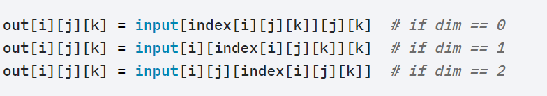

# Pytorch架构

[TOC]

## `torch`

### 运行基础

#### `torch.tensor`

> 参考：https://www.heywhale.com/mw/project/5e031a182823a10036af7132

学习过Numpy的读者会对本节内容感到非常熟悉，因tensor的接口有意设计成与Numpy类似，以方便用户使用。但不熟悉Numpy也没关系，本节内容并不要求先掌握Numpy。

从接口的角度来讲，对tensor的操作可分为两类：

1. `torch.function`，如`torch.save`等。
2. 另一类是`tensor.function`，如`tensor.view`等。

为方便使用，对tensor的大部分操作同时支持这两类接口，在本文档中不做具体区分，如`torch.sum(a, b)`与`a.sum(b)`功能等价。

而从存储的角度来讲，对tensor的操作又可分为两类：

1. 不会修改自身的数据，如 `a.add(b)`， 加法的结果会返回一个新的tensor。
2. 会修改自身的数据，如 `a.add_(b)`， 加法的结果仍存储在a中，a被修改了。

函数名以`_`结尾的都是inplace方式, 即会修改调用者自己的数据，在实际应用中需加以区分。、

##### 创建Tensor

常见的新建tensor方法

|                    函数                    |                           功能                            |
| :----------------------------------------: | :-------------------------------------------------------: |
|           `torch.Tensor(*sizes)`           |                       基础构造函数                        |
|           `torch.tensor(data,)`            |                  类似np.array的构造函数                   |
|            `torch.ones(*sizes)`            |                         全1Tensor                         |
|           `torch.zeros(*sizes)`            |                         全0Tensor                         |
|            `torch.eye(*sizes)`             |                    对角线为1，其他为0                     |
|          `torch.arange(s,e,step)`          |                    从s到e，步长为step                     |
|        `torch.linspace(s,e,steps)`         |                 从s到e，均匀切分成steps份                 |
|         `torch.rand/randn(*sizes)`         |                       均匀/标准分布                       |
| `torch.normal(mean,std)/uniform(from, to)` |                     正态分布/均匀分布                     |
|            `torch.randperm(m)`             |                         随机排列                          |
|           `torch.zeros_like(a)`            | 等价于torch.zeros(a.shape, dtype=a.dtype,device=a.device) |

这些创建方法都可以在创建的时候指定数据类型dtype和存放device(cpu/gpu).

**`torch.Tensor`**

其中使用`Tensor`函数新建tensor是最复杂多变的方式，它既可以接收一个list，并根据list的数据新建tensor，也能根据指定的形状新建tensor，还能传入其他的tensor，下面举几个例子。

```python
# 指定tensor的形状
a = torch.Tensor(2, 3)
# 用list的数据创建tensor
b = torch.Tensor([[1,2,3],[4,5,6]])
# 创建一个和b形状一样的tensor
c = torch.Tensor(b.size())
# 创建一个元素为2和3的tensor
d = t.Tensor((2, 3))

# 把tensor转为list
b.tolist()
```

需要注意的是，`t.Tensor(*sizes)`创建tensor时，系统不会马上分配空间，只是会计算剩余的内存是否足够使用，使用到tensor时才会分配，而其它操作都是在创建完tensor之后马上进行空间分配。

**`torch.Tensor()`与`torch.tensor()`创建张量区别**

1. 

   - `torch.Tensor(data)`：将输入的data转化为`torch.FloatTensor`
   - `torch.tensor(data)`：当未指定dtype类型时，将data转化为`torch.FloatTensor`、`torch.LongTensor`、`torch.DoubleTensor`等类型，转化类型依据于data的类型或dtype的值。

2. 

   - `torch.Tensor()`在创建空的tensor时，不用传入data参数。
   - `torch.tensor()`在创建空的tensor时，必须传入data参数，即空列表。
   - `torch.empty()`（返回一个没有初始化的tensor）在创建空tensor时，也需要传入空列表

   ```python
   a = torch.Tensor()
   b = torch.tensor([])
   c = torch.empty([])
   ```

   `torch.Tensor()`相当于`torch.tensor`与`torch.empty`的混合。

##### 常见tensor操作

|             函数              | 功能                                                         |
| :---------------------------: | :----------------------------------------------------------- |
|     `tensor.view(*sizes)`     | 调整tensor形状，调整前后元素总数一致。`view`不会修改自身数据，返回的新tensor与源tensor共享内存。 |
|  `tensor.squeeze(dim=None)`   | Returns a tensor with all the dimensions of `input` of size 1 removed. |
|    `tensor.unsqueeze(dim)`    | Returns a new tensor with a dimension of size one inserted at the specified position. |
|   `tensor.resize_(*sizes)`    | 修改tensor的大小。如果新大小超过了原大小，会自动分配新的内存空间，而如果新大小小于原大小，则之前的数据依旧会被保存 |
|  `tensor.gather(dim, index`)  | 沿着指定的维度收集值 |
| `tensor.scatter_(dim, index)` | 与gather相对，把取出的数据放回去。(in_place操作)             |
|        `tensor.item()`        | 对tensor的任何索引操作仍是一个tensor，想要获取标准的python对象数值，需要调用`tensor.item()`, 这个方法只对包含**一个元素的tensor**适用，与形状无关，包含一个值即可 |

##### 逐元素操作（point-wise/element-wise）

逐元素操作不会改变形状。

| 函数(torch.)                    | 功能                                                         |
| ------------------------------- | ------------------------------------------------------------ |
| abs/sqrt/div/exp/fmod/log/pow.. | 绝对值/平方根/除法/指数/求余/求幂..                          |
| cos/sin/asin/atan2/cosh         | 相关三角函数                                                 |
| ceil/round/floor/trunc          | 上取整/四舍五入/下取整/只保留整数部分                        |
| clamp(input, min, max)          | 超过min和max部分截断<br />$y_i =   \begin{cases}   min,  & \text{if  } x_i \lt min \\   x_i,  & \text{if  } min \le x_i \le max  \\   max,  & \text{if  } x_i \gt max\\   \end{cases}$ |
| sigmoid/tanh                    | 激活函数                                                     |

对于很多操作，例如div、mul、pow、fmod等，PyTorch都实现了运算符重载，所以可以直接使用运算符。如`a ** 2` 等价于`torch.pow(a,2)`, `a * 2`等价于`torch.mul(a,2)`。

##### 归并操作

此类操作会使输出形状小于输入形状，并可以沿着某一维度进行指定操作。

| 函数                 | 功能                |
| -------------------- | ------------------- |
| mean/sum/median/mode | 均值/和/中位数/众数 |
| norm/dist            | 范数/距离           |
| std/var              | 标准差/方差         |
| cumsum/cumprod       | 累加/累乘           |

以上大多数函数都有一个参数**`dim`**，用来指定这些操作是在哪个维度上执行的。

假设输入的形状是(m, n, k)

- 如果指定dim=0，输出的形状就是(1, n, k)或者(n, k)
- 如果指定dim=1，输出的形状就是(m, 1, k)或者(m, k)
- 如果指定dim=2，输出的形状就是(m, n, 1)或者(m, n)

size中是否有"1"，取决于参数`keepdim`，`keepdim=True`会保留维度`1`。

##### 比较

比较函数中有一些是逐元素比较，操作类似于逐元素操作，还有一些则类似于归并操作。

| 函数              | 功能                                  |
| ----------------- | ------------------------------------- |
| gt/lt/ge/le/eq/ne | 大于/小于/大于等于/小于等于/等于/不等 |
| topk              | 最大的k个数                           |
| sort              | 排序                                  |
| max/min           | 比较两个tensor最大最小值              |

表中第一行的比较操作已经实现了运算符重载，因此可以使用`a>=b`、`a>b`、`a!=b`、`a==b`，其返回结果是一个`ByteTensor`，可用来选取元素。

max/min这两个操作比较特殊，以max来说，它有以下三种使用情况：

- t.max(tensor)：返回tensor中最大的一个数

- t.max(tensor,dim)：指定维上最大的数，返回tensor和下标

- t.max(tensor1, tensor2): 比较两个tensor相比较大的元素

  ```python
  a = t.linspace(0, 15, 6).view(2, 3)
  # a = tensor([[ 0.,  3.,  6.],
  #              [ 9., 12., 15.]])
  b = t.linspace(15, 0, 6).view(2, 3)
  # b = tensor([[15., 12.,  9.],
  #        [ 6.,  3.,  0.]])
  a>b
  #tensor([[False, False, False],
  #        [ True,  True,  True]])
  
  a[a>b] # a中大于b的元素
  # tensor([ 9., 12., 15.])
  
  torch.max(a)
  # tensor(15.)
  t.max(b, dim=1) 
  """
  torch.return_types.max(
  values=tensor([15.,  6.]),
  indices=tensor([0, 0]))
  """
  t.max(a,b)
  """
  tensor([[15., 12.,  9.],
          [ 9., 12., 15.]])
  """
  ```

##### 线性代数

| 函数                           | 功能                              |
| ------------------------------ | --------------------------------- |
| trace                          | 对角线元素之和（矩阵的迹）        |
| diag                           | 对角线元素                        |
| triu/tril                      | 矩阵的上三角/下三角，可指定偏移量 |
| mm/bmm                         | 矩阵乘法，batch的矩阵乘法         |
| addmm/addbmm/addmv/addr/badbmm | 矩阵运算                          |
| t                              | 转置                              |
| dot/cross                      | 内积/外积                         |
| inverse                        | 求逆矩阵                          |
| svd                            | 奇异值分解                        |

注：矩阵的转置会导致存储空间不连续，需调用`.contiguous()`方法将其转为连续。

##### Tensor和Numpy

Tensor和Numpy数组之间具有很高的相似性，彼此之间的互操作也非常简单高效。需要注意的是，Numpy和Tensor共享内存。由于Numpy历史悠久，支持丰富的操作，所以当遇到Tensor不支持的操作时，可先转成Numpy数组，处理后再转回tensor，其转换开销很小。

```python
>>>import numpy as np
>>>a = np.ones([2, 3],dtype=np.float32)
array([[1., 1., 1.],
       [1., 1., 1.]], dtype=float32)
>>>b = torch.from_numpy(a)
tensor([[1., 1., 1.],
        [1., 1., 1.]])
>>>b = torch.Tensor(a) # 也可直接将对象传入Tensor
tensor([[1., 1., 1.],
        [1., 1., 1.]])
>>>a[0, 1] = 100
>>>print(b)
tensor([[  1., 100.,   1.],
        [  1.,   1.,   1.]])
>>>c = b.numpy()
array([[  1., 100.,   1.],
       [  1.,   1.,   1.]], dtype=float32)
```

==注==：当numpy的数据类型和Tensor的类型不一样的时候，数据会被复制，不会共享内存。

不论输入类型是是什么，`torch.tensor`都会进行数据拷贝，不会共享内存。（区分`torch.Tensor`）

#### `torch.autograd`

**待补充..**

> 参考：https://www.heywhale.com/mw/project/5e0315a62823a10036af6f8d

### `torch.utils`

#### `utils.data`

Pytorch提供了两个原始接口用于处理和数据相关的任务，分别是`torch.utils.data.DataLoader` 和`torch.utils.data.Dataset`。`Dataset`用于储存样本和对应的标签信息，`DataLoader`用迭代器的方式封装了Dataset。

在使用Pytorch数据准备时分为两步：

- `datasets`API下载数据/使用自带的数据集
- `DataLoader`API迭代数据

##### `utils.data.Dataset`

1. 使用Pytorch`Dataset`库中提供的数据集

   ```python
   import torch
   from torch.utils.data import Dataset
   from torchvision import datasets
   from torchvision.io import ToTensor
   
   #以FashionMNIST举例
   train_data = datasets.FashionMNIST(
       root="path",
       train=True,
       download=True,
       transform=ToTensor()
   )
   
   test_data = datasets.FashionMNIST(
       root="data",
       train=False,
       download=True,
       transform=ToTensor()
   )
   ```

   - `root` is the path where the train/test data is stored.

   - `train` specifies training or test dataset.

   - `download=True` downloads the data from the internet if it's not available at `root`.

   - `transform` and `target_transform` specify the feature and label transformations.

2. 使用自带的数据集

   这类情况需要我们定义自己的Dataset类来实现灵活的数据读取，定义的类需要继承Pytorch自身的Dataset类，主要包含三个函数：

   - `__init__`：用于向类中传入外部参数，同时定义样本集
   - `__getitem__`：用于逐个读取样本集合中的元素，可以进行一定的变换，并将返回训练/验证所需的数据
   - `__len__`：用于返回数据集的样本数

   ```python
   import os
   import pandas as pd
   from torchvision.io import read_image
   from torch.utils.data import Dataset
   """
   例：将图片存储在image_path目录下，标签以CSV文件形式存储在label_csv_path目录下。
   
   label_csv格式如下：
       tshirt1.jpg, 0
       tshirt2.jpg, 0
       ......
   	ankleboot999.jpg, 9
   
   如果数据集图片-标签的存储形式不同，相应的代码也需要修改。
   最终目的是通过每张图片的路径读取图片，将image及对应的label返回。
   """
   class CustomImageDataset(Dataset):
   	def __init__(self, image_path, label_csv_path, transform=None, target_transform=None):
           self.img_path = image_path
       	self.label_csv = pd.read_csv(label_csv_path)
           self.transform = transform
           self.target_transform = target_transform
           
       def __len__(self):
           return len(self.label_csv)
       
       def __getitem__(self, idx):
           img_path = os.path.join(self.img_path, self.label_csv.iloc[idx,0])
           image = read_image(img_path)
           label = self.label_csv.iloc[idx,1]
           if self.transform:
               image = self.transform(image)
           if self.target_transform:
               image = self.target_transform(image)
           return image, label
   ```

   > 可以用不同的工具包读取数据：
   >
   > - ```python
   >   from PIL import Image
   >   image = Image.open("file_path")
   >   # 读取的image数据类型为PIL
   >   ```
   >
   > - ```python
   >   from torchvision.io import read_image
   >   image = read_image("file_path")
   >   # 读取的image数据类型为Tensor
   >   ```
   >
   > - ```python
   >   # opencv库
   >   import cv2
   >   image = cv2.imread("file_path")
   >   # 读取的image数据类型为numpy.ndarray
   >   ```


##### `utils.data.DataLoader`

1. 构建好Dataset后，就可以使用DataLoader来按批次读入数据了，实现代码如下：

   ```python
   from torch.utils.data import DataLoader
   
   train_loader = DataLoader(train_data, batch_size=64, shuffle=True)
   test_loader = DataLoader(test_data, batch_size=64, shuffle=True)
   ```

   `DataLoader`函数常用参数：

   - `batch_size`：每次读入的样本数
   - `num_workers`：有多少个进程用于读取数据
   - `shuffle`：是否将读入的数据打乱
   - `drop_last`：对于样本最后一部分没有达到批次数的样本，使其不再参与训练

Pytorch中的`DataLoader`读取可以使用`next`和`iter`来完成：

```python
import matplotlib.pyplot as plt
images, labels = next(iter(val_loader))
print(images.shape)
plt.imshow(images[0].transpose(1,2,0))
plt.show()
```

#### `utils.tensorboard`

#### `utils.model_zoo`

### `torch.nn`

#### `nn.Module`

#### `nn.functional`

### `torch.optim`

### 神经网络的运算性能

#### `torch.torchelastic`

#### `torch.cuda`

### `torch.JIT`

### `torch.Storage`

---

## `torchvision`

### `torchvition.datasets`

### `torchvision.models`

### `torchvision.transforms`

#### transforms.Compose

`torchvision.transforms`是pytorch的图像预处理包，一般会用`transforms.Compose`将多个处理步骤整合到一起，支持链式处理。如：

```python
train_transform = transforms.Compose([
    transforms.Resize((32, 32)),# 缩放
    transforms.RandomCrop(32, padding=4), #裁剪
    transforms.ToTensor(), # 转为张量，同时归一化
    transforms.Normalize(norm_mean, norm_std),# 标准化
])
```

然后再通过自定义`Dataset`类中的`__getitem__`函数，进行图片的预处理。

#### transforms的脚本化

在torch1.7新增了该特性，现在的transform支持以下方式：

```python
import torch
import torchvision.transforms as T

# to fix random seed, use torch.manual_seed
# instead of random.seed
torch.manual_seed(12)

transforms = torch.nn.Sequential(
    T.RandomCrop(224),
    T.RandomHorizontalFlip(p=0.3),
    T.ConvertImageDtype(torch.float),
    T.Normalize([0.485, 0.456, 0.406], [0.229, 0.224, 0.225])
)
scripted_transforms = torch.jit.script(transforms)

tensor_image = torch.randint(0, 256, size=(3, 256, 256), dtype=torch.uint8)
# works directly on Tensors
out_image1 = transforms(tensor_image)
# on the GPU
out_image1_cuda = transforms(tensor_image.cuda())
# with batches
batched_image = torch.randint(0, 256, size=(4, 3, 256, 256), dtype=torch.uint8)
out_image_batched = transforms(batched_image)
# and has torchscript support
out_image2 = scripted_transforms(tensor_image)
```

transforms脚本化的优点：

- 数据增强可以支持GPU加速
- Batch化transformation，视频处理中使用更方便
- 可以支持多channel的tensor增强，而不仅仅是3通道或者4通道的tensor

#### 其他预处理函数

- `Resize`：把给定的图片resize到指定大小
- `Normalize`：对图像进行标准化
- `ToTensor`：将numpy.ndarray或PIL数据类型转换成Tensor数据类型
- `CenterCop`：中心剪切
- `ColorJitter`：随机改变图像的亮度对比度饱和度
- `ToPILImage`：将tensor转换为PIL图像
- `RandomCrop`：在一个随机位置进行裁剪
- `RandomHorizontalFlip`：以0.5的概率水平翻转给定的PIL图像
- `RandomVerticalFlip`：以0.5的概率竖直翻转给定的PIL图像
- `RandomResizedCrop`：将PIL图像裁剪成任意大小和横纵比
- `Grayscale`：将图像转换为灰度图像
- `RandomGrayscale`：将图像以一定的概率转换为灰度图像
- `FiceCrop`：把图像裁剪为四个角和一个中心


## `torchtext`

### `torchtext.data`

### `torchtext.datasets`

## `torchaudio`

### `torchaudio.datasets`

### `torchaudio.transforms`

### `torchaudio.models`

### `torchaudio.functional`

