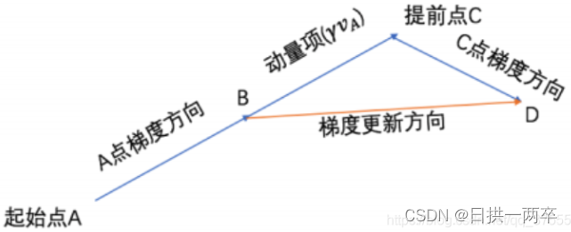

# 优化器

## SGD

SGD（Stochstic Gradient Descent，随机梯度下降）：每次从训练集随机选择一个样本来进行梯度下降更新模型参数。
$$
g_{t} = \triangledown_\theta L(\theta^{t})\\
\theta_{t+1}=\theta_{t}-\eta g_{t}
$$

- 优点：
  1. 每次只用一个样本更新模型参数，更新速度快；
  2. 随机梯度下降带来的波动有利于优化方向，从当前的局部极小值点跳到另一个更好的局部极小值点，对于非凸函数，最终收敛于较好的局部极值点，甚至全局极值点。
- 缺点：
  1. 由于每次参数更新时采用的数据量很小，造成梯度更新时震荡幅度大，容易受到异常值的影响，在最优解附近会有较大的波动，但大多数情况都是向着梯度减小的方向；（沿陡峭方向震荡，沿平缓维度进展缓慢，难以迅速收敛）
  2. 当遇到局部最优值或者鞍点时，梯度为0，无法继续更新参数。

## SGD with Momentum

算法思想：参数更新时在一定程度上保留之前更新的方向，同时又利用当前batch的梯度微调最终更新的方向，简而言之就是通过积累之前的动量来加速当前的梯度更新。

更新规则：
$$
Movement\ v^{t+1}=\lambda v^{t}-\eta\triangledown L(\theta^{t})\\
\theta^{t+1}=\theta^{t}+v^{t+1}
$$

- 优点：
  1. 在梯度方向改变时，momentum能够降低参数更新速度，从而减少震荡；
     在梯度方向相同时，momentum可以加速参数更新，从而加速收敛；
  2. 在局部最小值和鞍点时，梯度不为零，可以避免局部极小值。

## SGD with Nesterov

更新规则：
$$
Movement\ v^{t+1}=\lambda v^t-\eta \triangledown L(\theta^t+\lambda v^t)\\
\theta^{t+1}=\theta^t+v^t
$$
当从A点走到B点时，分别求出了动量项$\lambda v^t$和提前点C点的梯度$\triangledown L(\theta ^t+\lambda v^t)$，从而得出B点的梯度更新方向BD。好处是如果在C点发生了梯度反向反转，则B点可以提前获取到这个信息，修正B的梯度更新值BD，减少收敛过程中的震荡。若C点梯度方向不变，则会在下一次梯度方向上产生加速效果。

---

## 自适应学习率优化算法

自适应学习率优化算法针对于机器学习模型的学习率，传统的优化算法要么将学习率设置为常数要么根据训练次数调节学习率。极大忽视了学习率其他变化的可能性。然而，学习率对模型的性能有着显著的影响，因此需要采取一些策略来想办法更新学习率，从而提高训练速度。

自适应学习率算法主要包括：AdaGrad、RMSProp、Adam、lazyadam等

## AdaGrad

算法思想：独立地适应所有参数的学习率。对于更新频繁的参数，其历史梯度总和往往较大，希望步长小一点，使得学习到的参数更稳定；对于更新不频繁的参数（稀疏特征），其历史梯度总和往往较小，希望步长大一点，多学一点知识。

更新规则：
$$
\theta^{t+1}=\theta^{t}-\frac{\eta}{\sqrt{\sum^{t}_{i=0}(g_i)^2}}g_t
$$
缺点：

1. 中后期，分母上累积梯度会越来越大，分母趋向于0，学习收缩，最终会变得非常小而使训练提前结束。
2. 历史梯度权值均相同。常识来说，越近的时间步越重要，越远的时间步越不重要。

## RMSProp

与AdaGrad相似，在此基础上加入了迭代衰减。
$$
v_{t+1}=\alpha v_t+(1-\alpha)(g_{t})^2\\
\theta^{t+1}=\theta^t-\frac{\eta}{v_{t+1}}g_t\\
$$
在RMSProp中，分母不是历史梯度的简单累积，而是加入了衰减因子$\alpha$。使时间步跨度越大的梯度影响越小，时间步跨度越小的梯度影响越大。同时缓解了因为梯度累积而造成的分母过大问题。

## Adam

Adam是SGDM（一阶动量）和RMSProp（二阶动量）的结合。

更新规则：
$$
m_t=\beta_1m_{t-1}+(1-\beta_1)g_t\\
v_t=\beta_2v_{t-1}+(1-\beta_2)(g_t)^2\\
\theta^{t+1}=\theta^t-\eta\frac{m_t}{\sqrt{v_t}+\epsilon}
$$
公式1：计算历史梯度的一阶指数平滑值，用于得到带有动量的梯度值；

公式2：计算历史梯度平方的一阶指数平滑值，用于得到每个权重参数的学习率权重参数

公式3：计算变量更新值，变量更新值正比于历史梯度的一阶指数平滑值，反比与历史梯度平方的一阶指数平滑值。

## lazyadam...

待补充