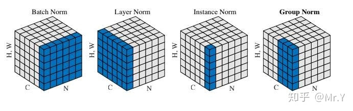

# 深度学习 Q & A

[TOC]

### Q1：归一化算法

> 参考：https://zhuanlan.zhihu.com/p/86765356

#### Batch Normalization(BN)

**原理**

差不多是效果最好的，feature map：$ x∈\mathbb{R}^{N×C×H×W }$,包含 $N $个样本，每个样本通道数为 $C$，高为 $H$，宽为 $W$。对其求均值和方差时，将在 $N、H、W$上操作，而保留通道$ C$ 的维度。具体来说，就是把第1个样本的第1个通道，加上第2个样本第1个通道 …… 加上第 N 个样本第1个通道，求平均，得到通道 1 的均值（注意是除以 $N×H×W $而不是单纯除以$ N$，最后得到的是一个代表这个 batch 第1个通道平均值的数字，而不是一个 $H×W$ 的矩阵）。求通道 1 的方差也是同理。对所有通道都施加一遍这个操作，就得到了所有通道的均值和方差。具体公式为：
$$
\mu_c(x)=\frac{1}{NHW}\sum^N_{n=1}\sum^H_{h=1}\sum^W_{w=1}x_{nchw}\\
\sigma_c(x)=\sqrt{\frac{1}{NHW}\sum^N_{n=1}\sum^H_{h=1}\sum^W_{w=1}(x_{nchw}-\mu_c(x))^2+\epsilon}
$$
如果把 $ x∈\mathbb{R}^{N×C×H×W }$ 类比为一摞书，这摞书总共有$ N $本，每本有$ C $页，每页有$ H$ 行，每行 $W$ 个字符。BN 求均值时，相当于把这些书按页码一一对应地加起来（例如第1本书第36页，第2本书第36页……），再除以每个页码下的字符总数：$N×H×W$，因此可以把 BN 看成求“平均书”的操作（注意这个“平均书”每页只有一个字），求标准差时也是同理。

**优缺点**

1. 优点
   - 
2. 缺点
   - 需要较大的batchsize才能合理估计训练数据的均值和方差，导致内存需求较大
   - 很难应用在训练数据长度不同的RNN模型上。

**应用场景**

#### Layer Normalization  (LN)

**原理**

对于$ x∈\mathbb{R}^{N×C×H×W }$，LN对每个样本的 C、H、W 维度上的数据求均值和标准差，保留 N 维度。其均值和标准差公式为：
$$
\mu_n(x)=\frac{1}{CHW}\sum^C_{c=1}\sum^H_{h=1}\sum^W_{w=1}x_{nchw}\\
\sigma_n(x)=\sqrt{\frac{1}{CHW}\sum^C_{c=1}\sum^H_{h=1}\sum^W_{w=1}(x_{nchw}-\mu_n(x))^2+\epsilon}
$$
把一个 batch 的 feature 类比为一摞书。LN 求均值时，相当于把每一本书的所有字加起来，再除以这本书的字符总数：$C×H×W$，即求整本书的“平均字”，求标准差时也是同理。

**优缺点**

1. 优点
   - 不需要批训练，在单条数据内部就能归一化
2. 缺点

**应用场景**

#### Instance Normalization (IN)

**原理**

Instance Normalization (IN) 最初用于图像的风格迁移。作者发现，在生成模型中， feature map 的各个 channel 的均值和方差会影响到最终生成图像的风格，因此可以先把图像在 channel 层面归一化，然后再用目标风格图片对应 channel 的均值和标准差“去归一化”，以期获得目标图片的风格。IN 操作也在单个样本内部进行，不依赖 batch。

对于 $ x∈\mathbb{R}^{N×C×H×W }$，IN 对每个样本的 $H、W$ 维度的数据求均值和标准差，保留 $N 、C $维度，也就是说，它只在 channel 内部求均值和标准差，其公式为：
$$
\mu_{nc}(x)=\frac{1}{HW}\sum^H_{h=1}\sum^W_{w=1}x_{nchw}\\
\sigma_{nc}(x)=\sqrt{\frac{1}{HW}\sum^H_{h=1}\sum^W_{w=1}(x_{nchw}-\mu_{nc}(x))^2+\epsilon}
$$
IN 求均值时，相当于把一页书中所有字加起来，再除以该页的总字数：$H×W$，即求每页书的“平均字”，求标准差时也是同理。

GN 计算均值和标准差时，把每一个样本 feature map 的 channel 分成 G 组，每组将有 $C/G$ 个 channel，然后将这些 channel 中的元素求均值和标准差。各组 channel 用其对应的归一化参数独立地归一化。
$$
\mu_{ng}(x)=\frac{1}{(C/G)HW}\sum^{(g+1)C/G}_{c=gC/G}\sum^H_{h=1}\sum^W_{w=1}x_{nchw}\\
\sigma_{ng}(x)=\sqrt{\frac{1}{(C/G)HW}\sum^{(g+1)C/G}_{c=gC/G}\sum^H_{h=1}\sum^W_{w=1}(x_{nchw}-\mu_{ng}(x))^2+\epsilon}
$$
继续用书类比。GN 相当于把一本 $C$ 页的书平均分成$ G $份，每份成为有 $C/G $页的小册子，求每个小册子的“平均字”和字的“标准差”。

**优缺点**

1. 优点
   - 
2. 缺点

**应用场景**

#### Group Normalization (GN)