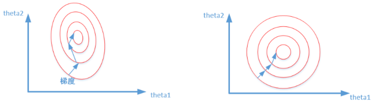
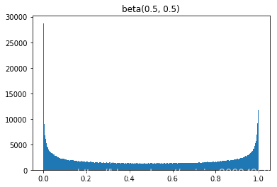
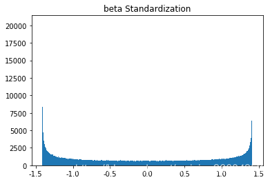

# 深度学习 Q & A

[TOC]

### Q1：归一化算法

> 参考：https://zhuanlan.zhihu.com/p/86765356

#### Batch Normalization(BN)

**原理**

差不多是效果最好的，feature map：$ x∈\mathbb{R}^{N×C×H×W }$,包含 $N $个样本，每个样本通道数为 $C$，高为 $H$，宽为 $W$。对其求均值和方差时，将在 $N、H、W$上操作，而保留通道$ C$ 的维度。具体来说，就是把第1个样本的第1个通道，加上第2个样本第1个通道 …… 加上第 N 个样本第1个通道，求平均，得到通道 1 的均值（注意是除以 $N×H×W $而不是单纯除以$ N$，最后得到的是一个代表这个 batch 第1个通道平均值的数字，而不是一个 $H×W$ 的矩阵）。求通道 1 的方差也是同理。对所有通道都施加一遍这个操作，就得到了所有通道的均值和方差。具体公式为：
$$
\mu_c(x)=\frac{1}{NHW}\sum^N_{n=1}\sum^H_{h=1}\sum^W_{w=1}x_{nchw}\\
\sigma_c(x)=\sqrt{\frac{1}{NHW}\sum^N_{n=1}\sum^H_{h=1}\sum^W_{w=1}(x_{nchw}-\mu_c(x))^2+\epsilon}
$$
如果把 $ x∈\mathbb{R}^{N×C×H×W }$ 类比为一摞书，这摞书总共有$ N $本，每本有$ C $页，每页有$ H$ 行，每行 $W$ 个字符。BN 求均值时，相当于把这些书按页码一一对应地加起来（例如第1本书第36页，第2本书第36页……），再除以每个页码下的字符总数：$N×H×W$，因此可以把 BN 看成求“平均书”的操作（注意这个“平均书”每页只有一个字），求标准差时也是同理。

**优缺点**

1. 优点
   - 
2. 缺点
   - 需要较大的batchsize才能合理估计训练数据的均值和方差，导致内存需求较大
   - 很难应用在训练数据长度不同的RNN模型上。

**应用场景**

#### Layer Normalization  (LN)

**原理**

对于$ x∈\mathbb{R}^{N×C×H×W }$，LN对每个样本的 C、H、W 维度上的数据求均值和标准差，保留 N 维度。其均值和标准差公式为：
$$
\mu_n(x)=\frac{1}{CHW}\sum^C_{c=1}\sum^H_{h=1}\sum^W_{w=1}x_{nchw}\\
\sigma_n(x)=\sqrt{\frac{1}{CHW}\sum^C_{c=1}\sum^H_{h=1}\sum^W_{w=1}(x_{nchw}-\mu_n(x))^2+\epsilon}
$$
把一个 batch 的 feature 类比为一摞书。LN 求均值时，相当于把每一本书的所有字加起来，再除以这本书的字符总数：$C×H×W$，即求整本书的“平均字”，求标准差时也是同理。

**优缺点**

1. 优点
   - 不需要批训练，在单条数据内部就能归一化
2. 缺点

**应用场景**

#### Instance Normalization (IN)

**原理**

Instance Normalization (IN) 最初用于图像的风格迁移。作者发现，在生成模型中， feature map 的各个 channel 的均值和方差会影响到最终生成图像的风格，因此可以先把图像在 channel 层面归一化，然后再用目标风格图片对应 channel 的均值和标准差“去归一化”，以期获得目标图片的风格。IN 操作也在单个样本内部进行，不依赖 batch。

对于 $ x∈\mathbb{R}^{N×C×H×W }$，IN 对每个样本的 $H、W$ 维度的数据求均值和标准差，保留 $N 、C $维度，也就是说，它只在 channel 内部求均值和标准差，其公式为：
$$
\mu_{nc}(x)=\frac{1}{HW}\sum^H_{h=1}\sum^W_{w=1}x_{nchw}\\
\sigma_{nc}(x)=\sqrt{\frac{1}{HW}\sum^H_{h=1}\sum^W_{w=1}(x_{nchw}-\mu_{nc}(x))^2+\epsilon}
$$
IN 求均值时，相当于把一页书中所有字加起来，再除以该页的总字数：$H×W$，即求每页书的“平均字”，求标准差时也是同理。

**优缺点**

1. 优点
   - 
2. 缺点

**应用场景**

#### Group Normalization (GN)

GN 计算均值和标准差时，把每一个样本 feature map 的 channel 分成 G 组，每组将有 $C/G$ 个 channel，然后将这些 channel 中的元素求均值和标准差。各组 channel 用其对应的归一化参数独立地归一化。
$$
\mu_{ng}(x)=\frac{1}{(C/G)HW}\sum^{(g+1)C/G}_{c=gC/G}\sum^H_{h=1}\sum^W_{w=1}x_{nchw}\\
\sigma_{ng}(x)=\sqrt{\frac{1}{(C/G)HW}\sum^{(g+1)C/G}_{c=gC/G}\sum^H_{h=1}\sum^W_{w=1}(x_{nchw}-\mu_{ng}(x))^2+\epsilon}
$$
继续用书类比。GN 相当于把一本 $C$ 页的书平均分成$ G $份，每份成为有 $C/G $页的小册子，求每个小册子的“平均字”和字的“标准差”。

### 标准化 & 归一化 & 中心化 & Feature Scaling

> 参考：
>
> https://blog.csdn.net/weixin_36604953/article/details/102652160
>
> https://www.cnblogs.com/shine-lee/p/11779514.html

- **标准化（Standardization）**：将数据变换为均值为0，标准差为1的分布。（不一定是正态的）。**会改变数据分布形状，不会改变分布种类。**
  $$
  标准化:\frac{X_i-\mu}{\sigma}
  $$

- **归一化（Normalization）**：将一列数据变化到某个固定区间中。通常，这个区间是[0,1]。广义的讲，可以是各种区间，比如映射到[0,1]一样可以继续映射到其他范围。图像中可能是[0,255]，其他情况可能映射到[-1, 1]，，**不改变数据的分布形状，不会改变分布种类**。这个范围就是归一化的特点：**如果对范围有要求，用归一化；如果存在特殊极值，不要用归一化。**
  $$
  归一化:\frac{X_i-X_{min}}{X_{max}-X_{min}}
  $$

- 中心化：即零均值处理。将每个原始数据减去这些数据的均值。

**标准化与归一化的差别**

1. 归一化会严格的限定变换后数据的范围，比如按之前最大最小值处理的归一化，它的范围严格在[0,1]之间；而标准化就没有严格的区间，变换后的数据没有范围，只是均值是0，标准差是1。
2. 归一化对数据的缩放比例仅仅和极大/小值有关，与中间数值无关；对于标准化而言，如果除去极大值和极小值其他数据都更换掉，那么均值和标准差大概率会改变，这时候，缩放比例自然也改变了。

**常见的Feature Scaling**

1. Rescaling(min-max normalization、range scaling)
   $$
   x^{\prime}=a+\frac{(x-\min (x))(b-a)}{\max (x)-\min (x)}
   $$
   将每一维特征线性映射到目标范围a,b，即将最小值映射为aa，最大值映射为bb，常用目标范围为0,1和−1,1，特别地，映射到0,1计算方式为：
   $$
   x^{\prime}=\frac{x-\min (x)}{\max (x)-\min (x)}
   $$

2. Mean normalization
   $$
   x^{\prime}=\frac{x-\bar{x}}{\max (x)-\min (x)}
   $$
   将均值映射为0，同时用最大值最小值对特征进行归一化。

3. Standardization(Z-score Normalization)
   $$
   x^{\prime}=\frac{x-\bar{x}}{\sigma}
   $$
   每维特征0均值1方差（zero-mean and unit-variance)

4. Scaling to unit length
   $$
   x^{\prime}=\frac{x}{\|x\|}
   $$
   将每个样本的特征向量除以其长度，即对样本特征向量的长度进行归一化，长度的度量常使用的是L2 norm（欧氏距离），有时也会采用L1 norm。

**Feature Scaling应用场景**（特征间有交互）

归一化、标准化本质上都是Feature Scaling，下面对Feature Scaling应用场景分析。

- 涉及或隐含**距离计算**的算法，比如K-means、KNN、PCA、SVM等，一般需要feature scaling，因为
  1. zero-mean一般可以增加样本间余弦距离或者内积结果的差异，区分力更强，假设数据集集中分布在第一象限遥远的右上角，将其平移到原点处，可以想象样本间余弦距离的差异被放大了。在模版匹配中，zero-mean可以明显提高响应结果的区分度。
  2. 就欧式距离而言，增大某个特征的尺度，相当于增加了其在距离计算中的权重，如果有明确的先验知识表明某个特征很重要，那么适当增加其权重可能有正向效果，但如果没有这样的先验，或者目的就是想知道哪些特征更重要，那么就需要先feature scaling，对各维特征等而视之。
  3. 增大尺度的同时也增大了该特征维度上的方差，PCA算法倾向于关注方差较大的特征所在的坐标轴方向，其他特征可能会被忽视，因此，在PCA前做Standardization效果可能更好梯度下降法时，加快模型收敛速度。
- 损失函数中含有**正则项**时，一般需要feature scaling：对于线性模型$y=wx+b$而言，$x$的任何线性变换（平移、放缩），都可以被$w$和$b$“吸收”掉，理论上，不会影响模型的拟合能力。但是，如果损失函数中含有正则项，如$λ||w||^2$，$λ$为超参数，其对$w$的每一个参数施加同样的惩罚，但对于某一维特征$x_i$而言，其scale越大，系数$w_i$越小，其在正则项中的比重就会变小，相当于对$w_i$惩罚变小，即损失函数会相对忽视那些scale增大的特征，这并不合理，所以需要feature scaling，使损失函数平等看待每一维特征。
- 梯度下降算法，需要feature scaling。

**什么时候不需要Feature Scaling**（特征间无交互）

- 与距离计算无关的概率类型，如朴素贝叶斯
- 与距离计算无关的基于树的模型，如决策树，随机森林。树中节点的选择只关注当前特征在哪里切分对分类更好，即**只在意特征内部的相对大小，与特征间的相对大小无关**。

==注==：

Standardization是改变数据分布，将其变换为服从N(0,1)的标准正态分布，这点是错的，Standardization会改变数据的均值、标准差都变了(当然，严格的说，均值和标准差变了，分布也是变了，但分布种类依然没变，原来是啥类型，现在就是啥类型)，但本质上的分布并不一定是标准正态，完全取决于原始数据是什么分布。

如原分布beta(0.5,0.5),通过计算机计算，样本$b_0$的均值和方差分别为0.49982和0.12497(约为0.5和0.125)

对这个数据做Standardization，称这个标准化后的数据为$b_1$，分布如下：

可以看到数据形态完全不是正态分布，但是数学期望和方差已经变了。beta分布的数学期望为$\frac{a}{a+b}$，方差为$\frac{ab}{(a+b)^2(a+b+1)}$ ，所以$E(b_0)=\frac{0.5}{0.5+0.5}=\frac{1}{2},Var(b_0)=\frac{1}{8}$，这也和我们上文所计算的样本均值和方差一致，而$b_1$的均值和方差分别为：-1.184190523417783e-1和1，均值和方差已经不再是0.5和0.125，分布改变，但绝不是一个正态分布。
